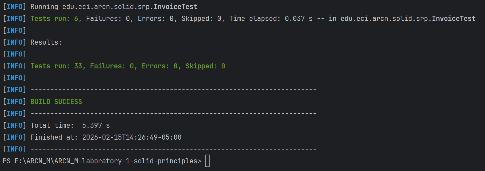

# 🏗️ SOLID Principles Laboratory
## Refactoring Java Code to Apply Software Design Best Practices

[](https://www.oracle.com/java/)
[](https://maven.apache.org/)
[](https://junit.org/junit5/)
[](https://github.com/features/codespaces)
[](LICENSE)

> **Business-Centric Architecture (ARCN_M)** - Laboratory 1  
> Practical implementation and refactoring exercises for **SOLID principles** in Java, demonstrating how to transform poorly designed code into maintainable, extensible, and testable software.

---

## 📋 **Table of Contents**

- [Overview](#-overview)
- [SOLID Principles Summary](#-solid-principles-summary)
- [Project Structure](#-project-structure)
- [Exercises and Solutions](#-exercises-and-solutions)
  - [SRP - Single Responsibility Principle](#1-srp---single-responsibility-principle)
  - [OCP - Open/Closed Principle](#2-ocp---openclosed-principle)
  - [LSP - Liskov Substitution Principle](#3-lsp---liskov-substitution-principle)
  - [ISP - Interface Segregation Principle](#4-isp---interface-segregation-principle)
  - [DIP - Dependency Inversion Principle](#5-dip---dependency-inversion-principle)
- [Design Patterns Applied](#-design-patterns-applied)
- [Testing Results](#-testing-results)
- [Installation and Usage](#-installation-and-usage)
- [Technologies Used](#-technologies-used)
- [Author](#-author)
- [License](#-license)
- [Additional Resources](#-additional-resources)

---

## 🌟 **Overview**

This laboratory demonstrates the practical application of the **SOLID principles** through refactoring exercises in Java. Students work with intentionally flawed code that violates each principle and transform it into clean, maintainable implementations.

### Learning Objectives

- ✅ **Understand** the theoretical foundation of each SOLID principle
- ✅ **Identify** code smells and violations in existing implementations
- ✅ **Refactor** code to adhere to best practices and design patterns
- ✅ **Validate** improvements through comprehensive unit testing
- ✅ **Apply** enterprise-grade software engineering practices

### Business Context

In **enterprise software development**, adherence to SOLID principles is critical for:

- 🔧 **Maintainability**: Easier code modifications and bug fixes
- 🚀 **Scalability**: Systems that grow without architectural decay
- 🧪 **Testability**: Isolated, mockable components
- 👥 **Collaboration**: Clear separation of concerns for team development
- 💰 **Cost Reduction**: Lower technical debt and development overhead

This laboratory bridges **academic understanding** with **professional engineering practice**, preparing students for real-world software development challenges.

---

## 🎯 **SOLID Principles Summary**

| Principle | Acronym | Core Concept |
|-----------|---------|--------------|
| **Single Responsibility** | **SRP** | A class should have only one reason to change |
| **Open/Closed** | **OCP** | Open for extension, closed for modification |
| **Liskov Substitution** | **LSP** | Subtypes must be substitutable for their base types |
| **Interface Segregation** | **ISP** | Clients shouldn't depend on interfaces they don't use |
| **Dependency Inversion** | **DIP** | Depend on abstractions, not concretions |

---

## 📁 **Project Structure**

```
ARCN_M-laboratory-1-solid-principles/
│
├── .gitignore
├── pom.xml
├── README.md
├── DESIGN_PATTERNS.md
├── LICENSE
│
├── .devcontainer/
│   └── devcontainer.json
│
├── assets/
│   └── images/
│       └── 01-unit-test-execution.png
│
├── src/
│   ├── main/
│   │   └── java/
│   │       └── edu/
│   │           └── eci/
│   │               └── arcn/
│   │                   └── solid/
│   │                       ├── srp/
│   │                       │   ├── bad/
│   │                       │   │   └── Invoice.java
│   │                       │   └── good/
│   │                       │       ├── Invoice.java
│   │                       │       ├── InvoicePrinter.java
│   │                       │       └── InvoiceRepository.java
│   │                       │
│   │                       ├── ocp/
│   │                       │   ├── bad/
│   │                       │   │   └── DiscountCalculator.java
│   │                       │   └── good/
│   │                       │       ├── DiscountStrategy.java
│   │                       │       ├── RegularCustomerDiscount.java
│   │                       │       ├── VIPCustomerDiscount.java
│   │                       │       └── DiscountCalculator.java
│   │                       │
│   │                       ├── lsp/
│   │                       │   ├── bad/
│   │                       │   │   ├── Car.java
│   │                       │   │   └── ElectricCar.java
│   │                       │   └── good/
│   │                       │       ├── Vehicle.java
│   │                       │       ├── Rechargeable.java
│   │                       │       ├── Refuelable.java
│   │                       │       ├── GasolineCar.java
│   │                       │       └── ElectricCar.java
│   │                       │
│   │                       ├── isp/
│   │                       │   ├── bad/
│   │                       │   │   ├── Worker.java
│   │                       │   │   └── Developer.java
│   │                       │   └── good/
│   │                       │       ├── Workable.java
│   │                       │       ├── Eatable.java
│   │                       │       ├── Developer.java
│   │                       │       └── Robot.java
│   │                       │
│   │                       └── dip/
│   │                           ├── bad/
│   │                           │   ├── MySQLDatabase.java
│   │                           │   └── OrderProcessor.java
│   │                           └── good/
│   │                               ├── Database.java
│   │                               ├── MySQLDatabase.java
│   │                               ├── PostgreSQLDatabase.java
│   │                               └── OrderProcessor.java
│   │
│   └── test/
│       └── java/
│           └── edu/
│               └── eci/
│                   └── arcn/
│                       └── solid/
│                           ├── srp/
│                           │   └── InvoiceTest.java
│                           ├── ocp/
│                           │   └── DiscountCalculatorTest.java
│                           ├── lsp/
│                           │   └── VehicleTest.java
│                           ├── isp/
│                           │   └── WorkerTest.java
│                           └── dip/
│                               └── OrderProcessorTest.java
```

### Directory Organization

- **`bad/`**: Original implementations violating SOLID principles
- **`good/`**: Refactored solutions following best practices
- **`test/`**: Comprehensive unit tests validating implementations

---

## 🔨 **Exercises and Solutions**

### 1. SRP - Single Responsibility Principle

**Principle Definition:**

> *"A class should have only one reason to change"*  
> — Robert C. Martin

#### ❌ Problem: The `Invoice` Class Violates SRP

The original `Invoice` class handles **three different responsibilities**:

1. **Business Logic**: Calculating invoice totals
2. **Presentation**: Printing invoice details
3. **Persistence**: Saving to database

```java
public class Invoice {
    private String customer;
    private double amount;

    public double calculateTotal() {
        return amount * 1.21;  // Business logic
    }

    public void printInvoice() {
        System.out.println("Factura para: " + customer);  // Presentation
    }

    public void saveToDatabase() {
        System.out.println("Guardando factura...");  // Persistence
    }
}
```

**Violation**: Changes to printing format or database structure require modifying the `Invoice` class.

#### ✅ Solution: Separate Concerns

**Design Pattern Applied**: **Separation of Concerns (SoC)**

The refactored solution splits responsibilities across three classes:

1. **`Invoice`**: Pure data model + business logic
2. **`InvoicePrinter`**: Handles presentation
3. **`InvoiceRepository`**: Manages persistence

```java
// Invoice.java - Single responsibility: Data + calculation
public class Invoice {
    private String customer;
    private double amount;

    public double calculateTotal() {
        return amount * 1.21;
    }
}

// InvoicePrinter.java - Single responsibility: Presentation
public class InvoicePrinter {
    public void print(Invoice invoice) {
        System.out.println("Factura para: " + invoice.getCustomer());
        System.out.println("Total: " + invoice.calculateTotal());
    }
}

// InvoiceRepository.java - Single responsibility: Persistence
public class InvoiceRepository {
    public void save(Invoice invoice) {
        System.out.println("Guardando factura...");
    }
}
```

**Benefits:**
- ✅ Each class has a **single reason to change**
- ✅ Easier to **test** each responsibility independently
- ✅ **Reusable** components (e.g., printer can be swapped)

---

### 2. OCP - Open/Closed Principle

**Principle Definition:**

> *"Software entities should be open for extension, but closed for modification"*  
> — Bertrand Meyer

#### ❌ Problem: Adding New Customer Types Requires Modification

```java
public class DiscountCalculator {
    public double calculateDiscount(String customerType, double price) {
        if (customerType.equals("Regular")) {
            return price * 0.10;
        } else if (customerType.equals("VIP")) {
            return price * 0.20;
        }
        return 0;
    }
}
```

**Violation**: Adding a "Premium" customer type requires modifying the `DiscountCalculator` class.

#### ✅ Solution: Strategy Pattern

**Design Pattern Applied**: **Strategy Pattern**

```java
// DiscountStrategy.java - Abstraction
public interface DiscountStrategy {
    double calculateDiscount(double price);
}

// RegularCustomerDiscount.java - Concrete strategy
public class RegularCustomerDiscount implements DiscountStrategy {
    @Override
    public double calculateDiscount(double price) {
        return price * 0.10;
    }
}

// VIPCustomerDiscount.java - Concrete strategy
public class VIPCustomerDiscount implements DiscountStrategy {
    @Override
    public double calculateDiscount(double price) {
        return price * 0.20;
    }
}

// DiscountCalculator.java - Context
public class DiscountCalculator {
    private DiscountStrategy strategy;

    public DiscountCalculator(DiscountStrategy strategy) {
        this.strategy = strategy;
    }

    public double calculateDiscount(double price) {
        return strategy.calculateDiscount(price);
    }
}
```

**Benefits:**
- ✅ **New strategies** can be added without modifying existing code
- ✅ **Runtime flexibility**: Strategy can be swapped dynamically
- ✅ Adheres to **Open/Closed Principle**

---

### 3. LSP - Liskov Substitution Principle

**Principle Definition:**

> *"Objects of a superclass should be replaceable with objects of a subclass without breaking the application"*  
> — Barbara Liskov

#### ❌ Problem: `ElectricCar` Cannot Replace `Car`

```java
public class Car {
    public void drive() {
        System.out.println("Conduciendo...");
    }

    public void refuel() {
        System.out.println("Repostando...");
    }
}

class ElectricCar extends Car {
    @Override
    public void refuel() {
        throw new UnsupportedOperationException("Los coches eléctricos no usan combustible.");
    }
}
```

**Violation**: Substituting `Car` with `ElectricCar` breaks the contract (throws exception).

#### ✅ Solution: Interface Segregation with Specialized Contracts

**Design Pattern Applied**: **Interface Segregation + Composition**

```java
// Vehicle.java - Common behavior
public interface Vehicle {
    void drive();
}

// Refuelable.java - Gasoline-specific
public interface Refuelable {
    void refuel();
}

// Rechargeable.java - Electric-specific
public interface Rechargeable {
    void recharge();
}

// GasolineCar.java - Implements applicable interfaces
public class GasolineCar implements Vehicle, Refuelable {
    @Override
    public void drive() {
        System.out.println("Conduciendo coche de gasolina...");
    }

    @Override
    public void refuel() {
        System.out.println("Repostando gasolina...");
    }
}

// ElectricCar.java - Implements applicable interfaces
public class ElectricCar implements Vehicle, Rechargeable {
    @Override
    public void drive() {
        System.out.println("Conduciendo coche eléctrico...");
    }

    @Override
    public void recharge() {
        System.out.println("Recargando batería...");
    }
}
```

**Benefits:**
- ✅ **No broken contracts**: Each class implements only applicable behaviors
- ✅ **Type safety**: Compiler prevents invalid operations
- ✅ **Proper substitution**: `Vehicle` references work for both types

---

### 4. ISP - Interface Segregation Principle

**Principle Definition:**

> *"No client should be forced to depend on methods it does not use"*  
> — Robert C. Martin

#### ❌ Problem: `Developer` Forced to Implement Irrelevant Method

```java
public interface Worker {
    void work();
    void eat();
}

class Developer implements Worker {
    @Override
    public void work() {
        System.out.println("Escribiendo código...");
    }

    @Override
    public void eat() {
        throw new UnsupportedOperationException("Sin horario fijo de almuerzo.");
    }
}
```

**Violation**: `Developer` is forced to implement `eat()` even though it's not applicable.

#### ✅ Solution: Split into Cohesive Interfaces

**Design Pattern Applied**: **Interface Segregation**

```java
// Workable.java - Work behavior
public interface Workable {
    void work();
}

// Eatable.java - Eating behavior
public interface Eatable {
    void eat();
}

// Developer.java - Human worker implements both
public class Developer implements Workable, Eatable {
    @Override
    public void work() {
        System.out.println("Escribiendo código...");
    }

    @Override
    public void eat() {
        System.out.println("Tomando descanso para almorzar...");
    }
}

// Robot.java - Only implements relevant interface
public class Robot implements Workable {
    @Override
    public void work() {
        System.out.println("Robot trabajando...");
    }
}
```

**Benefits:**
- ✅ **Clients depend only on what they use**
- ✅ **No forced implementations**: `Robot` doesn't need `eat()`
- ✅ **Fine-grained interfaces**: Better composability

---

### 5. DIP - Dependency Inversion Principle

**Principle Definition:**

> *"High-level modules should not depend on low-level modules. Both should depend on abstractions"*  
> — Robert C. Martin

#### ❌ Problem: `OrderProcessor` Depends on Concrete Implementation

```java
public class MySQLDatabase {
    public void saveOrder() {
        System.out.println("Guardando pedido en MySQL...");
    }
}

class OrderProcessor {
    private MySQLDatabase database;

    public OrderProcessor() {
        this.database = new MySQLDatabase();  // Tight coupling
    }

    public void processOrder() {
        System.out.println("Procesando pedido...");
        database.saveOrder();
    }
}
```

**Violation**: Changing database requires modifying `OrderProcessor`.

#### ✅ Solution: Depend on Abstraction + Dependency Injection

**Design Pattern Applied**: **Dependency Injection (Constructor Injection)**

```java
// Database.java - Abstraction
public interface Database {
    void saveOrder();
}

// MySQLDatabase.java - Concrete implementation
public class MySQLDatabase implements Database {
    @Override
    public void saveOrder() {
        System.out.println("Guardando pedido en MySQL...");
    }
}

// PostgreSQLDatabase.java - Alternative implementation
public class PostgreSQLDatabase implements Database {
    @Override
    public void saveOrder() {
        System.out.println("Guardando pedido en PostgreSQL...");
    }
}

// OrderProcessor.java - Depends on abstraction
public class OrderProcessor {
    private Database database;

    public OrderProcessor(Database database) {  // Dependency injection
        this.database = database;
    }

    public void processOrder() {
        System.out.println("Procesando pedido...");
        database.saveOrder();
    }
}
```

**Usage:**
```java
// Runtime injection - MySQL
Database mysqlDb = new MySQLDatabase();
OrderProcessor processor1 = new OrderProcessor(mysqlDb);

// Runtime injection - PostgreSQL
Database postgresDb = new PostgreSQLDatabase();
OrderProcessor processor2 = new OrderProcessor(postgresDb);
```

**Benefits:**
- ✅ **Loose coupling**: `OrderProcessor` doesn't know concrete database
- ✅ **Easy swapping**: Database can be changed without code modification
- ✅ **Testability**: Mock implementations can be injected for testing

---

## 🎨 **Design Patterns Applied**

| SOLID Principle | Design Pattern | Implementation |
|-----------------|----------------|----------------|
| **SRP** | Separation of Concerns | Split `Invoice` into `Invoice`, `InvoicePrinter`, `InvoiceRepository` |
| **OCP** | Strategy Pattern | `DiscountStrategy` interface with concrete strategies |
| **LSP** | Interface Segregation + Composition | Separate `Refuelable` and `Rechargeable` interfaces |
| **ISP** | Interface Segregation | Split `Worker` into `Workable` and `Eatable` |
| **DIP** | Dependency Injection | Constructor injection with `Database` abstraction |

For detailed pattern explanations, see [`DESIGN_PATTERNS.md`](DESIGN_PATTERNS.md).

---

## ✅ **Testing Results**

All **33 unit tests** executed successfully with **0 failures**, validating the correctness of refactored implementations:



### Test Coverage Summary

| Principle | Test Class | Tests | Status |
|-----------|------------|-------|--------|
| **SRP** | `InvoiceTest` | 6 | ✅ Pass |
| **OCP** | `DiscountCalculatorTest` | 6 | ✅ Pass |
| **LSP** | `VehicleTest` | 7 | ✅ Pass |
| **ISP** | `WorkerTest` | 7 | ✅ Pass |
| **DIP** | `OrderProcessorTest` | 7 | ✅ Pass |
| **TOTAL** | — | **33** | ✅ **All Pass** |

### Running Tests

```bash
# Execute all tests
mvn test

# Run specific test class
mvn test -Dtest=InvoiceTest

# Generate coverage report
mvn clean test jacoco:report
```

---

## 🚀 **Installation and Usage**

### Prerequisites

- **Java 17+**: [Download Java](https://www.oracle.com/java/technologies/downloads/)
- **Maven 3.8+**: [Install Maven](https://maven.apache.org/install.html)
- **Git**: [Install Git](https://git-scm.com/downloads)

### Local Setup

```bash
# Clone repository
git clone https://github.com/JAPV-X2612/ARCN_M-laboratory-1-solid-principles.git
cd ARCN_M-laboratory-1-solid-principles

# Compile project
mvn clean compile

# Run tests
mvn test

# Package as JAR
mvn package
```

### GitHub Codespaces Setup

1. Navigate to [GitHub Codespaces](https://github.com/features/codespaces)
2. Open repository: `ARCN_M-laboratory-1-solid-principles`
3. Click **Code** → **Codespaces** → **Create codespace on main**
4. Wait for container initialization (`.devcontainer/devcontainer.json`)
5. Run tests:
   ```bash
   mvn test
   ```

### DevContainer Configuration

The `.devcontainer/devcontainer.json` provides:

- ☕ **Java 17** runtime
- 📦 **Maven** build tool
- 🧰 **VSCode Java extensions**
- 🔧 **Automatic dependency installation**

---

## 🛠️ **Technologies Used**

### Core Technologies

- **Java 17**: Modern Java features (records, text blocks, pattern matching)
- **Maven 3.8+**: Dependency management and build automation
- **JUnit 5.10.1**: Unit testing framework with assertions and parameterized tests
- **Mockito 5.8.0**: Mocking framework for isolated testing

### Development Tools

- **GitHub Codespaces**: Cloud-based development environment
- **VSCode**: Primary IDE with Java extensions
- **Git**: Version control system

### Maven Dependencies

```xml
<dependencies>
    <!-- JUnit 5 -->
    <dependency>
        <groupId>org.junit.jupiter</groupId>
        <artifactId>junit-jupiter-api</artifactId>
        <version>5.10.1</version>
        <scope>test</scope>
    </dependency>
    
    <!-- Mockito -->
    <dependency>
        <groupId>org.mockito</groupId>
        <artifactId>mockito-core</artifactId>
        <version>5.8.0</version>
        <scope>test</scope>
    </dependency>
</dependencies>
```

---

## 👥 **Author**

<table>
  <tr>
    <td align="center">
      <a href="https://github.com/JAPV-X2612">
        
        <br />
        <sub><b>Jesús Alfonso Pinzón Vega</b></sub>
      </a>
      <br />
      <sub>Full Stack Developer</sub>
    </td>
  </tr>
</table>

---

## 📄 **License**

This project is licensed under the **Apache License, Version 2.0** - see the [LICENSE](LICENSE) file for details.

```
Copyright 2026 Jesús Alfonso Pinzón Vega

Licensed under the Apache License, Version 2.0 (the "License");
you may not use this file except in compliance with the License.
You may obtain a copy of the License at

    http://www.apache.org/licenses/LICENSE-2.0

Unless required by applicable law or agreed to in writing, software
distributed under the License is distributed on an "AS IS" BASIS,
WITHOUT WARRANTIES OR CONDITIONS OF ANY KIND, either express or implied.
See the License for the specific language governing permissions and
limitations under the License.
```

---

## 🔗 **Additional Resources**

### SOLID Principles

- [Robert C. Martin - Clean Code](https://www.oreilly.com/library/view/clean-code-a/9780136083238/)
- [SOLID Principles - Baeldung](https://www.baeldung.com/solid-principles)
- [Uncle Bob - SOLID Principles](https://blog.cleancoder.com/uncle-bob/2020/10/18/Solid-Relevance.html)

### Design Patterns

- [Gang of Four - Design Patterns](https://refactoring.guru/design-patterns/catalog)
- [Strategy Pattern Explained](https://refactoring.guru/design-patterns/strategy)
- [Dependency Injection Guide](https://martinfowler.com/articles/injection.html)

### Java & Testing

- [Oracle Java Documentation](https://docs.oracle.com/en/java/)
- [JUnit 5 User Guide](https://junit.org/junit5/docs/current/user-guide/)
- [Mockito Documentation](https://javadoc.io/doc/org.mockito/mockito-core/latest/org/mockito/Mockito.html)
- [Maven Getting Started Guide](https://maven.apache.org/guides/getting-started/)

### Best Practices

- [Clean Architecture - Robert C. Martin](https://blog.cleancoder.com/uncle-bob/2012/08/13/the-clean-architecture.html)
- [Effective Java - Joshua Bloch](https://www.oreilly.com/library/view/effective-java/9780134686097/)
- [Java Code Conventions](https://www.oracle.com/java/technologies/javase/codeconventions-introduction.html)

### GitHub & Codespaces

- [GitHub Codespaces Documentation](https://docs.github.com/en/codespaces)
- [Dev Container Specification](https://containers.dev/)
- [GitHub Actions for Java](https://docs.github.com/en/actions/automating-builds-and-tests/building-and-testing-java-with-maven)

---

⭐ **If you found this laboratory helpful, please consider giving it a star!** ⭐
